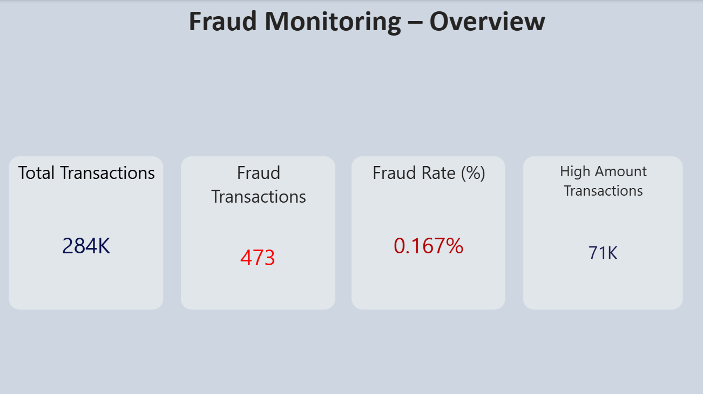
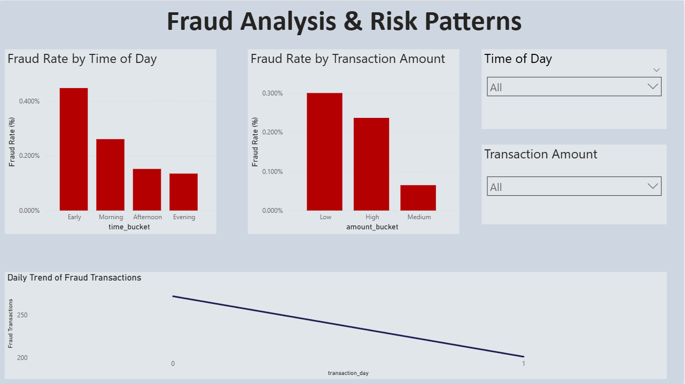

# Fraud-Risk-Analysis
End-to-end fraud risk analysis dashboard using Python, Excel, and Power BI.

# Fraud Risk Analysis Dashboard

## Overview
This project presents an end-to-end fraud risk analysis solution built to analyze credit card transaction data and identify high-risk patterns using rate-based analysis. The dashboard focuses on fraud monitoring, segmentation, and deep-dive risk insights rather than machine learning-based detection.

## Dataset
- Credit Card Fraud Detection Dataset (Kaggle)
- ~280,000 anonymized credit card transactions
- Highly imbalanced fraud data (<0.2% fraud rate)

## Tools & Technologies
- **Python** (Pandas, NumPy) – data cleaning, preprocessing, feature engineering  
- **Excel** (Pivot Tables) – KPI validation and exploratory analysis  
- **Power BI** (DAX, Data Modeling) – interactive dashboards and risk analysis  
- **Data Analysis Concepts** – EDA, rate-based analysis, fraud risk segmentation  

## Project Workflow
1. Cleaned and transformed raw transaction data in Python, handling duplicates and deriving time and amount-based features.
2. Validated key fraud metrics in Excel using pivot-based analysis.
3. Built interactive Power BI dashboards using DAX measures to analyze fraud rates, trends, and high-risk segments.
4. Designed multi-page dashboards for overview monitoring, fraud analysis, and deep-dive insights.

## Dashboard Pages

### 1. Overview
High-level KPIs summarizing transaction volume and fraud risk.
- Total Transactions
- Fraud Transactions
- Fraud Rate (%)
- High-Amount Transactions

---

### 2. Fraud Analysis
Analysis of fraud risk patterns using rate-based metrics.
- Fraud Rate by Time of Day
- Fraud Rate by Transaction Amount
- Daily Fraud Transaction Trends

---

### 3. Fraud Deep Dive
Focused analysis comparing fraud risk vs transaction volume and high-value transaction behavior.
- Fraud Rate vs Transaction Volume (Combo Chart)
- High-Amount Fraud Rate by Time
- Fraud Contribution by Transaction Amount

## Key Insights
- Fraud risk is not evenly distributed across time and transaction value segments.
- High-value transactions show disproportionately higher fraud rates.
- Certain time windows exhibit elevated fraud risk independent of transaction volume.

## Limitations & Future Improvements
- Dataset lacks customer-level and real-time attributes.
- Future enhancements could include customer segmentation, false-positive analysis, and integration with live transaction streams.

## Author
Harshada Jadhav
